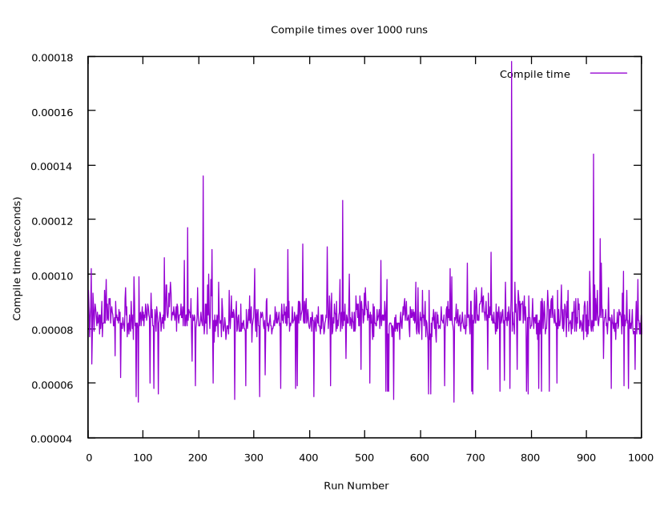
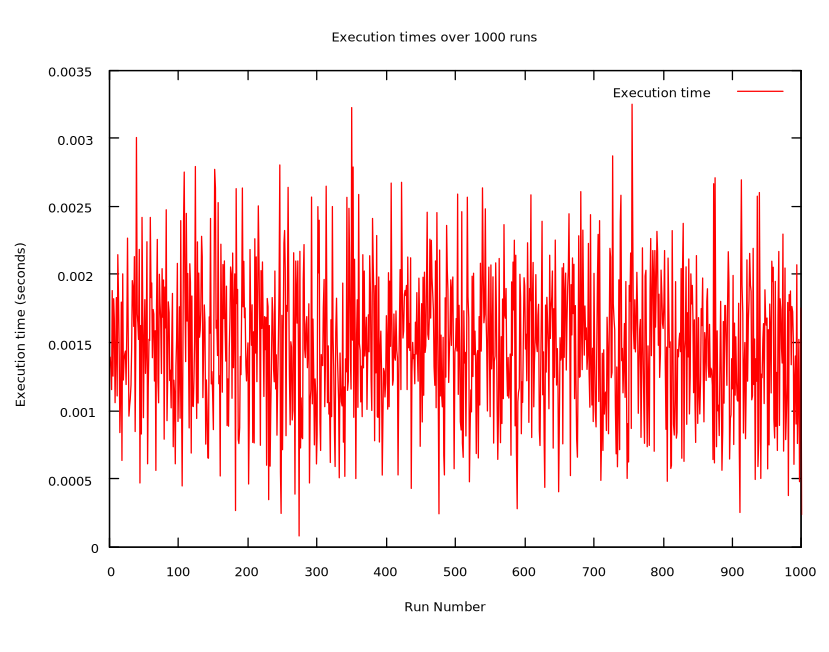

# BrainrotLangC

This project is Arnav Murthi's [BrainrotLang](https://github.com/aLEGEND21/BrainrotLang) rewritten in C.

execution times are measuring node execution times, which has no real connection to the compiler

## Performance

### Average

Compile time was measured using clock from time.h

Execution times were measured using strace

Average compile time: .00008360s (83.6 microseconds)

Average execution time: .00148191s (1.48 miliseconds)
